<div align="center">

<!-- Terminal Hero Section: Monochrome ASCII portrait beside Neofetch developer card -->
<h3><code>kamesprabu@github ~ $ whoami</code></h3>

<table>
  <tr>
    <td valign="top">
      
    </td>
    <td valign="top">
      
    </td>
  </tr>
</table>

<br>

<!-- Animated Contribution Graph: Live GitHub public data refreshed daily via GitHub Actions -->
<h3><code>kamesprabu@github ~ $ ./contributions.sh --year</code></h3>


</div>

<br>

---

### <code>kamesprabu@github ~ $ cat about_me.md</code>

I am a software builder focused on building robust systems at the intersection of **Python**, **Artificial Intelligence**, and **Cloud & DevOps Infrastructure**. 

My core development foundation is centered on **Python** and **Linux**, with active hands-on exploration in designing scalable **AWS cloud architectures**, automating **CI/CD delivery pipelines**, and building modern **AI / LLM agent workflows**.

---

### <code>kamesprabu@github ~ $ ./stack.sh --summary</code>

```
PRIMARY DIRECTION: Python + AI + Cloud + DevOps
```

#### 🟢 Core Capabilities (Established Stack)
Technologies and tools I currently know and work with:

* **Programming:** Python
* **Operating Systems:** Linux (CLI, Shell workflows, Server environments)
* **Version Control & Collaboration:** Git, GitHub
* **Development:** REST APIs & Backend integrations

#### 🚀 Currently Learning & Building Toward
Technologies, frameworks, and methodologies I am actively studying, implementing in lab environments, and building toward:

* **Artificial Intelligence & AI Engineering:**
  * Machine Learning fundamentals
  * Large Language Models (LLMs) & Prompt Systems
  * AI Agents & Tool-augmented workflows
  * AI Engineering architectures

* **Cloud Infrastructure (AWS):**
  * Amazon Web Services (AWS core services)
  * Cloud Computing & System Architecture
  * Cloud Infrastructure provisioning
  * Cloud Deployment strategies

* **DevOps & Automation:**
  * Containerization with **Docker**
  * CI/CD pipelines with **Jenkins** & **GitHub Actions**
  * Infrastructure as Code (IaC) & Automation
  * Container Orchestration with **Kubernetes**
  * Deployment workflows & System Monitoring

---

### <code>kamesprabu@github ~ $ cat ./connect.sh</code>

* **GitHub:** [@kamesprabum](https://github.com/kamesprabum)
* **Repositories:** [Explore My Repositories](https://github.com/kamesprabum?tab=repositories)

---

<div align="center">
  <sub>Generated with custom SVG animation & automated via GitHub Actions • No external stats services • Minimalist & Token-free</sub>
</div>
